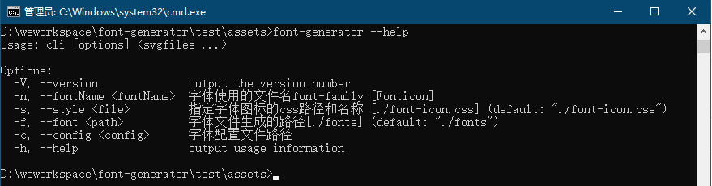

# 脚手架工具创建字体图标

## 安装 
```javascript
npm install font-generator -g
```
> 安装过程中可能会有报错，不影响实际使用

## 帮助
在命令行工具执行
```shell
font-generator --help
```


支持配置文件
```json
{
  "fontName": "ConfigFont",
  "style"   : "./dist/config/css/config.css",
  "font"    : "./dist/config/config/fonts",
  "svgFiles": "./assets/*.svg"
}
```
 
实例
> 在某个静态页面项目下面打开命令行窗口，将 img/svg/ 目录下的svg图标全部制作成字体图标。


```shell
    font-generator img/svg/*.svg --style css/font.css --font img/fonts
```

_尝遍人间甘辛味，言外冷暖我自知_
